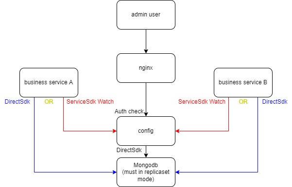

# config


**如需在生产环境使用,请修改util/util.go中的servicecipher**

**如需在生产环境使用,建议对编译后的二进制文件使用upx等软件加壳压缩**
```
config是一个微服务.
运行cmd脚本可查看使用方法.windows下将./cmd.sh换为cmd.bat
./cmd.sh help 输出帮助信息
./cmd.sh pb 解析proto文件,生成桩代码
./cmd.sh new 在该项目中创建一个新的子服务
./cmd.sh kube 增加或者更新kubernetes的配置
```

### 服务端口
```
6060                                    MONITOR AND PPROF
8000                                    WEB
9000                                    CRPC
10000                                   GRPC
```

## 环境变量
```
LOG_TARGET                              日志等级,debug,info(default),warning,error
LOG_TRACE                               是否开启链路追踪,1-开启,0-关闭(default)
LOG_TARGET                              日志输出目标,std-输出到标准输出,file-输出到文件(可执行文件相同目录),both-两者都输出
GROUP                                   该项目所属的group(k8s的namespace),如果不使用k8s需要手动指定,如果使用k8s,需修改项目根目录的deployment.yaml中的<GROUP>
RUN_ENV                                 当前运行环境,如:test,pre,prod
DEPLOY_ENV                              部署环境,如:ali-kube-shanghai-1,ali-host-hangzhou-1
MONITOR                                 是否开启系统监控采集,0关闭,1开启
CONFIG_TYPE                             配置类型
                                        0-使用本地配置
                                        1-监听config数据库
REMOTE_CONFIG_MONGO_URL                 当CONFIG_TYPE为1时,配置中心mongodb的url,[mongodb/mongodb+srv]://[username:password@]host1,...,hostN[/dbname][?param1=value1&...&paramN=valueN]
                                        (必须要有写权限)
```

## 配置文件
```
AppConfig.json该文件配置了该服务需要使用的业务配置,可热更新
SourceConfig.json该文件配置了该服务需要使用的资源配置,不热更新
```

## DB
### Mongo
#### config
```
database: config_{groupname}
collection: {appname}
{
	"_id":ObjectId("xxxx"),
	"index":0,//always be 0
	"cipher":"",
	"cur_index":0,
	"max_index":0,//auto increment(every time insert a new config log)
	"cur_version":0,//auto increment(every time insert or rollback)
	"cur_app_config":"",
	"cur_source_config":"",
}//summary
{
	"_id":ObjectId("xxx"),
	"index":1,//always > 0
	"app_config":"",
	"source_config":""
}//log
//index field add unique index
```
#### admin
```
database: admin
collection: node
{
	"_id":ObjectId("xxx"),//meaningless
	"node_id":[0,1],
	"node_name":"",
	"node_data":"",
	"cur_node_index":0,//auto increment,this is for child's node_id
	"children":[1,2],//self is [0,1],has two children [0,1,1] and [0,1,2]
}
//node_id field add unique index

collection: user
{
	"_id":ObjectId("xxx")//userid
}

collection: usernode
{
	"_id":ObjectId("xxx"),//meaningless
	"user_id":ObjectId("xxx"),
	"node_id":[0,1],
	"r":1,//can read
	"w":1,//can write
	"x":1,//admin on this node
}
//user_id+node_id field add unique index
//node_id field add index
```
