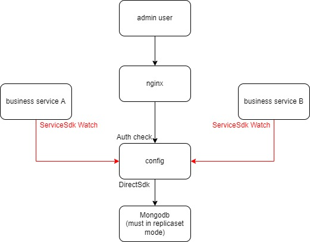

# config

警告:该服务必须部署至少2个实例,如果只有一个实例,当该实例下线时(需要1s内无任何请求才能正式下线),客户端会不停重试,而所有的重试请求只能发送给正在下线的唯一的实例,进而阻止该实例的下线
```
config是一个微服务.
运行cmd脚本可查看使用方法.windows下将./cmd.sh换为cmd.bat
./cmd.sh help 输出帮助信息
./cmd.sh pb 解析proto文件,生成桩代码
./cmd.sh new 在该项目中创建一个新的子服务
./cmd.sh kube 增加或者更新kubernetes的配置
```

### 服务端口
```
6060                                    MONITOR AND PPROF
8000                                    WEB
9000                                    CRPC
10000                                   GRPC
```

## 环境变量
```
GROUP                                   该项目所属的group(k8s的namespace),如果不使用k8s需要手动指定,如果使用k8s,需修改项目根目录的deployment.yaml中的<GROUP>
RUN_ENV                                 当前运行环境,如:test,pre,prod
DEPLOY_ENV                              部署环境,如:ali-kube-shanghai-1,ali-host-hangzhou-1
MONITOR                                 是否开启系统监控采集,0关闭,1开启
CONFIG_TYPE                             配置类型
                                        0-使用本地配置
                                        1-监听config数据库
REMOTE_CONFIG_MONGO_URL                 当CONFIG_TYPE为1时,配置中心mongodb的url,[mongodb/mongodb+srv]://[username:password@]host1,...,hostN[/dbname][?param1=value1&...&paramN=valueN]
```

## 配置文件
```
AppConfig.json该文件配置了该服务需要使用的业务配置,可热更新
SourceConfig.json该文件配置了该服务需要使用的资源配置,不热更新
```
